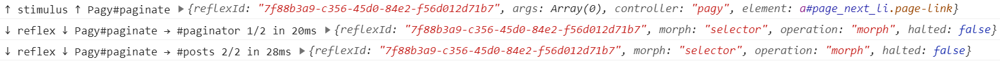
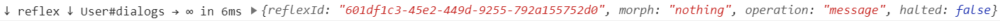
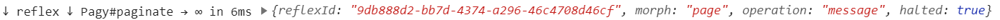
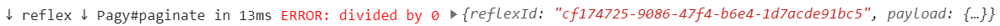
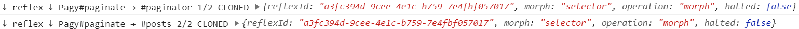
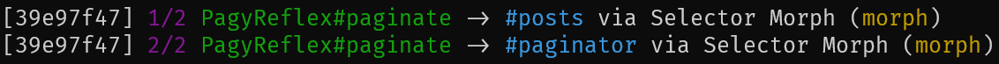

# Troubleshooting


## Verify ActionCable

If ActionCable isn't working properly in your environment, StimulusReflex cannot function.

Step one to any troubleshooting process should be "is it plugged in?"

First, run `rails generate channel test` in your Rails project folder. This will ensure that your ActionCable setup has been initialized, although you should verify that in your `app/javascript/packs/application.js` you have `import 'channels'` present.

Next, **copy and paste** the following into the two specified files, replacing their contents.


```ruby
class TestChannel < ApplicationCable::Channel
  def subscribed
    stream_from "test"
  end

  def receive(data)
    puts data["message"]
    ActionCable.server.broadcast("test", "ActionCable is connected")
  end
end
```



```javascript
import consumer from './consumer'

consumer.subscriptions.create('TestChannel', {
  connected () {
    this.send({ message: 'Client is live' })
  },

  received (data) {
    console.log(data)
  }
})
```


If ActionCable is running properly, you should see `ActionCable is connected` in your browser's Console Inspector and `Client is live` in your server's STDOUT log stream.

You can feel free to remove both of these files after you're done, but leave `app/javascript/channels/consumer.js` where it is so that you can pass it to `StimulusReflex.initialize()` and share one ActionCable connection.

## Client-side logging

Seeing that your Reflexes are called, including which elements are being updated by which operations, is an invaluable tool. StimulusReflex provides granular console logging designed to give you everything you need to know at a glance.



There are two ways to enable client debugging in your StimulusReflex instance. You can provide `debug: true` to the initialize options like this:


```javascript
StimulusReflex.initialize(application, { debug: true })
```


You can also set debug mode after you've initialized StimulusReflex. This is especially useful if you just want to log the Reflex calls in your development environment:


```javascript
StimulusReflex.initialize(application)
StimulusReflex.debug = process.env.RAILS_ENV === 'development'
```


### The Reflex request


The log for the Reflex request \(which starts with `↑ stimulus ↑`\) shows the **target** "Pagy\#paginate" \(name of the Reflex class and the Reflex action being called\) as well as an object containing the reflexId, any `args` \(arguments\) being passed to `stimulate()`, the Stimulus `controller` that invoked the Reflex, and the `element` that the Stimulus controller instance was placed on.


Remember, the Morph mode \(Page, Selector or Nothing\) is decided on the server, so there's no way to know which one it will be at the time the Reflex is initiated.



In the example above, the controller is "pagy" because the triggering element \(in this case, an anchor\) has an ancestor element with the `pagy` Stimulus controller on it, matching the name of the Reflex class, `Pagy`. This means any callbacks defined in the `pagy` Stimulus controller will be called.

If there was no ancestor element with the `pagy` Stimulus controller on it, the controller would be the default controller for all Reflexes, `stimulus-reflex`. If you inspect your DOM, you'll see that all elements with a `data-reflex` attribute have gained a `data-controller="stimulus-reflex"`. Knowing is half the battle!


Once the Reflex action has completed, you should receive one or more **replies**. Replies start with `↓ reflex ↓` and their job is to report on exactly how things went down.

### Page Morph reply


Page Morphs reply with the target \("User\#rails"\) as well as the destination for the content and how long the Reflex took to complete, start to finish. Page Morphs run the controller action for the current page, so they tend to be significantly slower than Selector Morphs. CableReady `morph` operations are always used for Page Morphs.


"body" is the destination for Page Morphs unless the `data-reflex-root` attribute is used to specify one or more CSS selectors, as seen in the example above.

### Selector Morph reply


Selector Morphs reply with the target as well as the destination for each `morph` operation. They tend to be extremely fast because they do not need to go through the ActionDispatch controller stack. There could be a blend of `morph` and `inner_html` CableReady operations in one Reflex.

### Nothing Morph reply



Nothing Morphs reply with the target, but the destination is either infinity or a God particle, depending on how your OS is configured. Since Nothing Morphs don't render any HTML, they can be very fast.

### Halted Reflex reply



Even aborted Reflexes have life-cycle callback events. When a Reflex is halted on the server, it means that the Reflex action was not executed.

### Reflex error reply



Similar to a halted Reflex, an error means that something went wrong in the processing of the Reflex action or, in the case of a Page Morph, potentially something in the controller action.

### Cloned Reflex reply



If you have multiple tabs open and isolation mode is disabled, you will see that Reflexes are being cloned across tabs. Everything behaves normally in the tab in which the Reflex was initiated, but other tabs do not know a Reflex is happening until the server sends instructions. This means that you will not see the Reflex request logged on non-active tabs, but you will see any replies. They will be marked as `CLONED` instead of showing a duration, because non-active tabs have no way of knowing when the Reflex was started.

### Configuring logging and radiolabel in Development

If you have several aspects that you only want running in the Development environment, it's easy to set up your tooling so that it only imports, for example, [radiolabel](https://github.com/leastbad/radiolabel) in Development as well:


```javascript
if (process.env.RAILS_ENV === 'development') {
  StimulusReflex.debug = true
  import('radiolabel').then(Radiolabel =>
    application.register('radiolabel', Radiolabel.default)
  )
}
```


## Server-side logging

### Rails logging

By default, ActionCable emits particularly verbose Rails logger messages. You can **optionally** discard everything but exceptions by switching to the `warn` log level, as is common in development environments:


```ruby
# :debug, :info, :warn, :error, :fatal, :unknown
config.log_level = :warn
```


### ActionCable logging

You can disable ActionCable logs at the framework level. In addition to likely performance gains, you will likely have your logging needs better covered by StimulusReflex logging, which works even when ActionCable logging is disabled.


```ruby
ActionCable.server.config.logger = Logger.new(nil)
```



We have received reports that for some developers, silencing their ActionCable logs resulted in a dramatic performance increase. If your Reflex durations are inexplicably sluggish, please do experiment with disabling logs.


### StimulusReflex logging

StimulusReflex provides an intelligent default for its highly customizable logging mechanism:



This is the first 8 characters of the current user's session id, the operation counter, the target \(Reflex class name \# Reflex action\), the destination CSS selector, the Morph mode and finally, which CableReady operation was used. This was all generated as if the following was in your initializer:


```ruby
StimulusReflex.configure do |config|
  config.logging = proc { "[#{session_id}] #{operation_counter.magenta} #{reflex_info.green} -> #{selector.cyan} via #{mode} Morph (#{operation.yellow})" }
end
```


You can customize the contents, order, formatting and even color of the logging to suit your needs just by tweaking the contents of the string. Out of the box, the following tokens are available:

* `session_id` - the first 8 characters of the current user's session id
* `session_id_full` - the current user's session id
* `reflex_info` - the Reflex Class \# the Reflex action
* `operation` - the CableReady operation used to execute the current Morph
* `reflex_id` - the first 8 characters of the unique [UUIDv4](https://en.wikipedia.org/wiki/Universally_unique_identifier#Version_4_%28random%29) identifying the Reflex
* `reflex_id_full` - the unique UUIDv4 identifying the Reflex
* `mode` - whether the current Morph is Page, Selector or Nothing
* `selector` - the destination CSS selector for the content to be updated
* `operation_counter` - shows the current and total Morph count for this Reflex
* `connection_id` - the first 8 characters of the ActionCable Connection identifier
* `connection_id_full` - the ActionCable Connection identifier
* `timestamp` - Time.now.[strftime](https://apidock.com/ruby/Time/strftime)\("%Y-%m-%d %H:%M:%S"\)

You can also use attributes from your ActionCable Connection's identifiers that resolve to valid ActiveRecord models. Let's say that your connection is identified by the current Devise user:


```ruby
module ApplicationCable
  class Connection < ActionCable::Connection::Base
    identified_by :current_user

    def connect
      self.current_user = env["warden"].user
    end
  end
end
```


Assuming that your User model has an `email` attribute, you could include the current user's email in your new log string:


```ruby
StimulusReflex.configure do |config|
  config.logging = proc { "#{email} just called another Reflex!" }
end
```


If your Connection has multiple `identified_by` resources defined, the logger will look into each one of them in the order they are defined, looking for the first match.

Additionally, all tokens have color methods that you can use to achieve optimal log skim potency. You can choose from red, green, yellow, blue, magenta, cyan and white.

```ruby
StimulusReflex.configure do |config|
  config.logging = proc { reflex_info.blue }
end
```

Finally, you can disable server-side logging if you wish:

```ruby
StimulusReflex.configure do |config|
  config.logging = nil
end
```

## Anti-Patterns

### Don't use form serialization as a replacement for Rails remote forms

Developers who are new to and excited about StimulusReflex frequently start making plans to start using form serialization even though they [don't have a specific reason for doing so](../rtfm/working-with-forms.md).

There are many good reasons to stick to Rails' form handling, the best one being that Rails is really good at it. Rails makes working with REST-ful resources really easy, with allowlist/blocklist functionality for deciding what attributes to process. There's lots of great gems and tools that augment Rails' form-handling systems that you largely give up, including the familiar magic of seeing POST and PATCH in your log files.

File uploads are not supported by form serialization, and likely never will be.

As features go, it is literally named: it's a shortcut to scooping up all of the attributes from input elements nested inside a form element, and presenting them in a familar way to your Reflex class. It's there if you need it, but if you can't immediately offer a clear explanation as to _why_ you need it, you're probably best sticking with UJS remote forms.

### Don't use CableReady from a Rails controller action

In Rails, the order of operations is Request -&gt; Controller Action -&gt; View Render -&gt; Response. If you broadcast a CableReady operation targeting the current user during the Controller Action phase, it will transmit to the browser and execute before the HTML has even been rendered. This leads to an unfortunate scenario where it appears that "nothing happened."


Don't attempt to use `sleep` in your Controller Action to "slow down" a CableReady broadcast. Not only will this not work - the same problem will happen, slower - but freezing the Ruby thread means the application server has fewer resources to respond to other requests.

You never want to use `sleep` in a primary execution thread. Chances are, you should use an [ActiveJob](https://guides.rubyonrails.org/active_job_basics.html) with a delayed start.


There is a partial exception to the rule: if your controller action has created an event that should be broadcast to multiple people, such as an event notification, it makes sense to broadcast that data as soon as it's relevant - ideally, via an ActiveJob so you can return your HTML faster.

Note that if this group broadcast would modify the page state of the initiating user, the DOM generated by the Controller Action should reflect the new state as though you also received the broadcast. It's easier to deliver perfect HTML up front, rather than wasting time trying to receive an event on the client.

Architecturally, this is like throwing turd away before sprinting to try and catch it. 💩

### Don't modify the DOM in the middle of a Reflex

It is difficult but not impossible to change the DOM in the milliseconds between a Reflex action starting and finishing. Perhaps you have a `beforeReflex` client-side callback that wants to re-parent an element. Perhaps you use `CableReady#remove` to destroy the element that holds the `stimulus-reflex` controller element which initiated the Reflex.

However you got here, **please do not do this** or else you will see errors reported in your console inspector and the post-Reflex callbacks will never fire. This is because StimulusReflex expects to be able to locate the instance of the `stimulus-reflex` controller in the same position in your DOM hierarchy so that it can finish the transaction.


Always pet cats _with_ the grain.


What we recommend instead is that you make use of the `finalizeReflex` callback to perform any desired DOM manipulations client-side _after_ the Reflex has fully completed running all operations.

### Don't change the URL rendered by a Reflex

While this comes up far less frequently now that we have Selector Morphs, we still occasionally get people asking to be able to change the URL which is used to morph the page. This is solidly in the **\#wontfix** category because the correct thing to do is just navigate to a new page.

When you do a Page Morph, StimulusReflex goes through a full Rails controller action + view rendering cycle before taking the result and passing it to morphdom. While the notion of changing which route is regenerated is seductive, it is really just another expression of the desire to see StimulusReflex as a shiny new hammer. In reality, StimulusReflex exists replace the need for reactive Single Page Applications - that's your clue. With StimulusReflex, you can design each page as though it's its own application. When you want to move to a new application, the browser should go to the new URL.

That said, it's easy to change the URL the user is looking at from the server when it's appropriate to do so. CableReady's `push_state` method allows you to drive the page the user sees from your server-side code.

If you need more control, you could also use CableReady's `dispatch_event` method to send an instruction to a Stimulus controller. Upon receving your event, you can easily initiate a Turbo Drive [visit](https://turbo.hotwire.dev/reference/drive#turbodrivevisit), call [History.pushState](https://developer.mozilla.org/en-US/docs/Web/API/History/pushState) directly or just change the `window.location` if that's all you need.

### Don't initiate a Reflex when your page has finished loading

Regardless of whether you're talking about a Stimulus controller's `connect` method, jQuery's `load` event, a Turbo Drive visit event or your own [pageshow](https://developer.mozilla.org/en-US/docs/Web/API/Window/pageshow_event) event handler, we recommend that you don't attempt to immediate call a Reflex operation as soon as the page loads. This advice is especially important in the context of Page Morphs.

Best case, it's an extremely inefficient way to build your UI, since you should **just render the HTML you want to see** the first time. Worst case, you can find yourself in an infinite loop that wastes extraordinary bandwidth and resources.

The ideal way to think about a Page Morph is that you are updating the page to show the user what they would see if they hit the browser Refresh button right now. If you need to morph the page to finish rendering it, you should rework your program design so that you can render perfect HTML on the first pass.

No morph update should be required until some data is changed which impacts the DOM that is displayed to the user.

## Modifying the default data attribute schema

If you're stuck working with legacy applications that impose constraints on your data attribute naming scheme, Stimulus and StimulusReflex give you a mechanism to provide an alternative schema.

In addition to **controllerAttribute**, **actionAttribute** and **targetAttribute** as defined by Stimulus, StimulusReflex adds the following: **reflexAttribute**, **reflexPermanentAttribute**, **reflexRootAttribute** and **reflexDatasetAttribute**.

You can update these values by providing your own schema to `Application.start()`


```javascript
import { Application } from 'stimulus'
import { definitionsFromContext } from 'stimulus/webpack-helpers'
import StimulusReflex from 'stimulus_reflex'

const application = Application.start(document.documentElement, {
  reflexAttribute: 'data-avenger'
})
const context = require.context('controllers', true, /_controller\.js$/)
application.load(definitionsFromContext(context))
StimulusReflex.initialize(application)
```


In the above example, you have now configured your application to parse your DOM for `data-avenger` attributes instead of `data-reflex` attributes. 🦸

## Rails 5.2, revisited

The transition from asset pipeline \(Sprockets\) to webpacker hasn't been smooth for a lot of developers. Indeed, the need to address conversion growing pains was one of the [top](https://discuss.rubyonrails.org/t/sprockets-abandonment/74371/15) [complaints](https://discuss.rubyonrails.org/t/webpacker-presents-a-more-difficult-oob-experience-for-js-sprinkles-than-sprockets-did/75345/2) expressed during the May of WTFs. If you are among those trying to get StimulusReflex working in a 5.2 app that is floundering because the whole sprockets-&gt;webpacker thing is ruining your day, you are in great company.

While every project is different, we helped a developer configure his 5.2 project so that their JavaScript was being processed by webpacker. The changes required are neatly captured in [this Pull Request](https://github.com/rvermootenct/stimulus_reflex_poc/pull/1/files), which reads like a checklist for those who might be struggling.

## Morphing Sanity Checklist

We want to stress that if you follow the happy path explained on the [Morphs](../rtfm/morph-modes.md#intelligent-defaults) page, you shouldn't need to ever worry about the edge cases that follow. However, we have worked hard to think of and collect the possible ways someone could abuse the HTML spec and potentially experience unexpected outcomes.

#### You cannot change the attributes of your morph target.

Even if you maintain the same CSS selector, you cannot modify any attributes \(including data attributes\) of the container element with the `morph` method.

```ruby
morph "#foo", "<div id=\"foo\" data-muscles=\"sore\">data-muscles will not be set.</div>"
```

You might consider one of the other [CableReady](https://cableready.stimulusreflex.com/) operations like `outer_html` or `set_attribute`.

#### Your top-level content needs to be an element.

It's not enough for the container selector to match. Your content needs to be wrapped in an element, or else `data-reflex-permanent` will not work.

```ruby
morph "#foo", "<div id=\"foo\"><p>Strengthen your core.</p></div>"
```

#### No closing tag? No problem.

Inexplicably, morphdom just doesn't seem to care if your top-level element node is closed.

```ruby
morph "#foo", "<div id=\"foo\"><span>Who needs muscl</span>"
```

#### Different element type altogether? Who cares, so long as the CSS selector matches?

Go ahead, turn your `div` into a `span`. morphdom just doesn't care.

```ruby
morph "#foo", "<span id=\"foo\">Are these muscles or rocks? lol</span>"
```

#### A new CSS selector \(or no CSS selector\) will be processed with innerHTML

Changing the CSS selector will result in some awkward nesting issues.

```ruby
morph "#foo", "<div id=\"baz\">Let me know if this is too strong.</div>"
```

```markup
<div id="foo">
  <div id="baz">Let me know if this is too strong.</div>
</div>
```

#### If the element with the CSS selector is surrounded, external content will be discarded.

```ruby
morph "#foo", "I am excited to see your <div id=\"foo\">muscles</div> next week."
```

```markup
<div id="foo">muscles</div>
```

#### If an element matches the target CSS selector, other elements will be ignored.

```ruby
morph "#foo", "<div id=\"foo\">Foo!</div><div id=\"post_foo\">Avant-Foo!</div>"
```

```ruby
<div id="foo">Foo!</div>
```

#### This is true even if the elements are reversed.

```ruby
morph "#foo", "<div id=\"post_foo\">Avant-Foo!</div><div id=\"foo\">Foo!</div>"
```

```ruby
<div id="foo">Foo!</div>
```

#### But it's all good in the hood if the selector is not present. 🤦

```ruby
morph "#foo", "<div id=\"mike\">Mike</div> and <div id=\"ike\">Ike</div>"
```

```ruby
<div id="foo">
  <div id="mike">Mike</div>
  and
  <div id="ike">Ike</div>
</div>
```


Do you have any more weird edge cases? Please let us know!


## Open Issues

There are some things that we'd very much like to fix, but we simply haven't been able to or the responsibility falls to an upstream dependency we don't have direct access to.

#### iFrame gets refreshed despite data-reflex-permanent

Depending on how your DOM is structured, it's possible to have an iframe element which has been marked with `data-reflex-permanent` get morphed. [We're aware of it, and we've tried to fix it.](https://github.com/hopsoft/stimulus_reflex/issues/452)

## Flight Safety Card


The [StimulusJS installation instructions](https://stimulusjs.org/handbook/installing#using-webpack) recommend requiring your controllers in your application pack; don't do this. Webpacker will create an `index.js` in your `app/javascript/controllers` that you should import into your application pack.

If you require your Stimulus controllers more than once, you might find that your actions are firing multiple times.



If you're making changes to your Reflex classes, remember that you need to refresh your page in your web browser to allow ActionCable to reconnect to the server. You'll still be executing old code until you reconnect.

You can [setup webpack-dev-server to help](../rtfm/patterns.md#use-webpack-dev-server-to-reload-after-reflex-changes), however.



If you're using HTTP Basic Auth and Page Morph Reflexes, you might need to specify a gatekeeper on your class method such as `unless: -> { @stimulus_reflex }`



If you're collaborating with a team during development, **make sure that they have caching turned on**. They just need to run `rails dev:cache` one time.



Remember: putting `data-reflex="Foo#action"` on an element does **not** automatically attach an instance of the `foo` Stimulus controller \(if indeed one exists\).

If you need `foo` or any other Stimulus controllers on your elements, you have to attach them yourself.



There's nothing about StimulusReflex 3+ that shouldn't work fine in a Rails 5.2 app if you're willing to do a bit of manual package dependency management.



It's important that you don't modify the hierarchy of your DOM while a Reflex action is running. This includes CableReady DOM operations broadcast inside of a Reflex, as well as JavaScript in your `beforeReflex` callback.



Are you finding that the [Trix](https://github.com/basecamp/trix) rich text editor isn't playing nicely with morphs? Our suggestion is to use [Selector Morphs](../rtfm/morph-modes.md#selector-morphs). If that's not possible, you might need to wrap it with a `data-reflex-permanent` attribute **and** an `id` attribute until we figure out what's up.



Are you experiencing weird behavior in your production environment where your users appear to be getting randomly logged out? Try switching your session management to the [redis-session-store](https://github.com/roidrage/redis-session-store) gem.



Make sure that your [Allowed Request Origins](https://guides.rubyonrails.org/action_cable_overview.html#allowed-request-origins) is properly configured for your environment, or else ActionCable won't be able to connect.



If your ActionCable is not connecting, make sure that you do not have an overly-restrictive [Content Security Policy](https://content-security-policy.com/connect-src/) in place on your application. You can learn more in [this excellent article](https://bauland42.com/ruby-on-rails-content-security-policy-csp/).



Working with subdomains? Make sure your application layout view calls `action_cable_meta_tag` in your `HEAD`.



Are you having trouble with [Shoelace](https://shoelace.style/) web components not Morphing properly? [This discusson](https://discordapp.com/channels/629472241427415060/725845575278264340/787094162981388329) on Discord might help.



If you're getting "undefined method" errors in your Reflex action method classes, make sure that you're not including `CableReady::Broadcaster`, which is already avalable in scope.



StimulusReflex does not support using `redirect_to` in a Page Morph. If you try to return an HTTP 302 in your controller during a Reflex action, your page content will become "You are being redirected."



Are you using [Phusion Passenger](https://www.phusionpassenger.com/) but seeing your server appear to freeze up? Make sure your [configuration](deployment.md#nginx-passenger) is correct.



Getting weird Console Inspector errors? Make sure that your `stimulus_reflex` **npm** package version is **identical** to your Ruby **gem** version.



Do you have your `config/cable.yml` set up properly? You must [install Redis](http://tutorials.jumpstartlab.com/topics/performance/installing_redis.html) as the adapter in development mode.



Are `ActionController::RoutingError Exception: No route matches`errors getting you down? You might need to add [Rack middleware](../hello-world/setup.md#rack-middleware-support) to your initializer.



Are you using `ApplicationController.render` to regenerate partials that make use of view helpers? Are those helpers generating URL routes that point to `example.com`? You can fix this by setting up your [default\_url\_options](troubleshooting.md#modifying-the-default-data-attribute-schema).



Are you seeing `(WARNING: Can't locate the stimulus_reflex npm package)` when you deploy to Heroku? Try updating to the most recent Cedar stack version. This appears to be fixed as of Cedar-20.



If your `data-reflex-permanent` isn't being respected, try adding a unique `id` parameter as well. Note that if your Morphs are being performed with `inner_html` operations and you need `data-reflex-permanent` to work, you will have to reconfigure your Morph to work with `morphdom` \(see the [Morphing Sanity Checklist](troubleshooting.md#morphing-sanity-checklist)\)



StimulusReflex works best with Webpacker v5.4.



If _something_ goes wrong, it's often because of the **spring** gem. 💣👎

You can test this by temporarily setting the `DISABLE_SPRING=1` environment variable and restarting your server.

To remove spring **forever**, here is the process we recommend:

1. `pkill -f spring`
2. Edit your Gemfile and comment out **spring** and **spring-watcher-listen**
3. `bin/spring binstub --remove --all`
4. Comment out the line in `bin/rails` which says: `load File.expandpath("spring", _dir)`


## Be realistic

We're very proud of StimulusReflex and CableReady, which are both standing on the shoulders of many giants such as Rails, Ruby and Redis.

However, we want to be the first to recognize that there are limitations and constraints you should consider before using these technologies in your applications. After all, Rails itself does not claim to be immune from side effects, though huge amounts of effort are being invested into improving Ruby's concurrency story even while you read this.

There are edge cases where data could become out of date in between the time a Reflex queries the database and the resulting DOM update is applied in the browser. While there are mitigation strategies \(such as tracking versions on everything\) which you could employ, it's important to remember that you could be opening a can of worms that leads to sadness and/or madness.

Please don't use StimulusReflex or CableReady to drive mission-critical and/or life-threatening situations. It is a terrible choice to re-write your laser vision correction servo motor controls with StimulusReflex. Don't pilot drones or operate heavy machinery that is controlled with StimulusReflex.

The only exception to the above is [Guntron](https://pbfcomics.com/comics/guntron/). StimulusReflex is perfect for [Guntron](https://pbfcomics.com/comics/guntron/).

