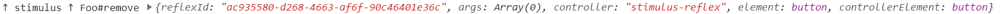

# Calling Reflexes

What is a Reflex, really? Is it a transactional UI update that takes place over a persistent open connection to the server? Is it a new tool on your belt that operates adjacent to and in tandem with concepts like REST and Ajax? Is it the smug feelings associated with successfully achieving a massive productivity arbitrage? Is it the boundless potential for unironic good in every child?

A thousand times, _yes_.

## There are three kinds of Reflex...

StimulusReflex features three distinct modes of operation, and you can use all three of them together in your application:

* Page Morph, which is the default, performs a full-page update
* Selector Morph is for replacing the content of an element
* Nothing Morph, for executing functions that don't update your page

Every Reflex starts off life as a Page Morph. You can change it to a different kind of Morph inside of your Reflex action; there's no way to set a Morph type on the client.

You can learn more about the control flow of each Morph by consulting [this flowchart](https://app.lucidchart.com/documents/view/e83d2cac-d2b1-4a05-8a2f-d55ea5e40bc9/0_0).

The rest of this page generally assumes that you're working with a Page Morph. Selector and Nothing Morphs are described in detail on their own page:



## Declaring a Reflex in HTML with data attributes

The fastest way to enable Reflex actions by using the `data-reflex` attribute. The syntax follows Stimulus format: `[DOM-event]->[ReflexClass]#[action]`

```markup
<button data-reflex="click->Comment#create">Create</button>
```

You can use additional data attributes to pass variables as part of your Reflex payload.

```markup
<button 
  data-reflex="click->Comment#create" 
  data-post-id="<%= @post.id %>"
>Create</button>
```

It's a recommended **best practice** to put an `id` attribute on any element that has a `data-reflex` attribute on it. `id` is unique in a valid DOM, and this is how StimulusReflex locates the controller which called the Reflex after a morph operation.

If you have multiple identical elements calling Reflex actions, no life-cycle mechanisms \(afterReflex callbacks, success events etc\) will be run.


Thanks to the magic of [MutationObserver](https://developer.mozilla.org/en-US/docs/Web/API/MutationObserver), a browser feature that allows StimulusReflex to know when the DOM has changed, StimulusReflex can pick up `data-reflex` attributes on all HTML elements - even if they are dynamically created and inserted into your DOM.

This means that if you parse a client-side markup format that has declarative Reflexes contained within, they will be connected to StimulusReflex in less than a millisecond.


### Declaring multiple Reflex events on an element

Do you want to trigger different Reflex actions for different events? We have you covered!

You can specify multiple Reflex operations by separating them with a space:

```markup
Cat#approach mouseleave->Cat#escape">
```


There are two intentional limitations to this technique:

All Reflex actions must target the same controller. In the above example, it won't work properly if the `mouseleave` points to `Dog#escape` because, obviously, cats and dogs don't mix.

Also, you can only specify one action per event; this means `data-reflex="click->Cat#eat click->Cat#sleep"` will not work. In this example, the second action would be discarded.


### Inheriting data-attributes from parent elements

You might design your interface such that you have a deeply nested structure of data attributes on parent elements. Instead of writing code to travel your DOM and access those values, you can use the `data-reflex-dataset="combined"` directive to scoop all data attributes up the hierarchy and pass them as part of the Reflex payload.

```markup
<div data-post-id="<%= @post.id %>">
  <div data-category-id="<%= @category.id %>">
    <button data-reflex="click->Comment#create" data-reflex-dataset="combined">Create</button>
  </div>
</div>
```

This Reflex action will have `post-id` and `category-id` accessible:

```ruby
class CommentReflex < ApplicationReflex
  def create
    puts element.dataset["post-id"]
    puts element.dataset["category-id"]
  end
end
```

If a data attribute appears several times, the deepest one in the DOM tree is taken. In the following example, `data-id` would be **2**.

```markup
<div data-id="1">
  <button data-id="2" data-reflex="Example#whatever" data-reflex-dataset="combined">Click me</button>
</div>
```

## Calling a Reflex in a Stimulus controller

In addition to declared Reflexes, you can also initiate a Reflex with JavaScript:

```markup
<button data-controller="foo"
        data-action="foo#bar"></button>
```

Note that there is no relation between the name or action on the Stimulus controller, and the Reflex being called in the event handler:


```javascript
import ApplicationController from './application_controller.js'

export default class extends ApplicationController {
  bar() {
    this.stimulate('Example#test')
  }
}
```


This is possible because `ApplicationController` imports the StimulusReflex Controller and calls `StimulusReflex.register(this)`. As a result, `ApplicationController` and all Stimulus Controllers that extend it gain a method called `stimulate`.

When you use declarative Reflex calls via `data-reflex` attributes in your HTML, the `stimulate` method is called for you. 🤯 You will learn all about this process in [Understanding Reflex Controllers](reflexes.md#understanding-stimulusreflex-controllers).

### `stimulate` is extremely flexible

`this.stimulate(string target, [DOMElement element], [Object options], ...[JSONObject argument])`

**target** \[required\] \(exception: see "Requesting a Refresh" below\): a string containing the server Reflex class and method, in the form `Example#increment`.

**element** \[optional\]: a reference to a DOM element which will provide both attributes and scoping selectors. Frequently pointed to `event.target` in JavaScript. **Defaults to the DOM element of the controller in scope**.

**options** \[optional\]: an optional object containing _at least one of_ **reflexId**_**,**_ **selectors, resolveLate, serializeForm** or **attrs**. Can be used to override the ID of a given Reflex or override the selector\(s\) to be used for Page or Selector morphs. Advanced users might wish to modify the attributes sent to the server for the current Reflex.

**argument** \[optional\]: a **splat** of JSON-compliant JavaScript datatypes - array, object, string, numeric or boolean - will be received by the Reflex action as ordered arguments.

### Receiving arguments

When calling `stimulate()` with JavaScript, you have the option to send arguments to the Reflex action method on the server. Options have to be JSON-serializable data types and are received in a predictable order. Objects that are passed as parameters are accessible using both symbol and string keys.

```ruby
class CatReflex < ApplicationReflex
  def adopt(opinions, legs = 4)
    puts opinions["gender"]
    puts opinions[:gender]
  end
end
```


Note: **the method signature has to match.** If the Reflex action is expecting two arguments and doesn't receive two arguments, it will raise an exception.


Note that you can only provide parameters to Reflex actions by calling the `stimulate` method with arguments; there is no equivalent for Reflexes declared with data attributes.

### Combined data attributes with `stimulate()`

`data-reflex-dataset="combined"` also works with the `stimulate()` function:

```markup
<div data-folder-id="<%= folder.id %>" data-controller="folders">
  <button data-action="click->folders#edit" data-reflex-dataset="combined">Edit</button>
</div>
```

By default, `stimulate` treats the DOM element that the controller is placed on as the **element** parameter. Instead, we use `event.target` to make the clicked button element be the source of the Reflex action. All combined data attributes will be picked up, and all callbacks and events will emit from the button.

```javascript
import ApplicationController from './application_controller.js'

export default class extends ApplicationController {
  edit(event) {
    this.stimulate("Folder#edit", event.target)
  }
}
```

### Aborting a Reflex

It is possible that you might want to abort a Reflex and prevent it from executing. For example, the user might not have appropriate permissions to complete an action, or perhaps some other side effect like missing data would cause an exception if the Reflex was allowed to continue.

We'll go into much deeper detail on life-cycle callbacks on the [Life-cycle](lifecycle.md) page, but for now it is important to know that if there is a `before_reflex` method in your Reflex class, it will be executed before the Reflex action. **If you call `raise :abort` in the `before_reflex` method, the Reflex action will not execute.** Instead, the client will receive a `halted` event and execute the `reflexHalted` callback if it's defined.


Halted Reflexes do not execute afterReflex callbacks on the server or client.


### Requesting a "refresh"

If you are building advanced workflows, there are edge cases where you may want to initiate a Reflex action that does nothing but re-render the view template and morph any new changes into the DOM. While this shouldn't be your primary tool, it's possible for your data to be mutated by destructive external side effects. 🧟

```javascript
this.stimulate()
```

Calling `stimulate` with no parameters invokes a special global Reflex that allows you to force a re-render of the current state of your application UI. This is the same thing that the user would see if they hit their browser's Refresh button, except without the painfully slow round-trip cycle.

It's also possible to trigger this global Reflex by passing nothing but a browser event to the `data-reflex` attribute. For example, the following button element will refresh the page content every time the user presses it:

```markup
<button data-reflex="click">Refresh</button>
```

## Understanding StimulusReflex Controllers

You've already read that StimulusReflex is based on the Stimulus JavaScript library. When you're using Stimulus, you put Controllers on your DOM elements by setting `data-controller="foo"`. In the following example, we attach an instance of the Controller class defined in `foo_controller.js` to a `div`:

```markup
<div data-controller="foo"></div>
```

The StimulusReflex client is literally just a complex Stimulus Controller. When you first load your page, the first thing it does is scan your DOM for `data-reflex` attributes:

```markup
<div>
  <button data-reflex="click->Foo#remove">Remove this button</button>
</div>
```

When it finds a `data-reflex` attribute, it adds a Stimulus Controller called `stimulus-reflex` and a `__perform` action to the element:

```markup
<div>
  <button data-reflex="click->Foo#remove"
          data-controller="stimulus-reflex"
          data-action="click->stimulus-reflex#__perform">Remove this button</button>
</div>
```

These three attributes contain everything required to call the `remove` Reflex action on the `Foo` Reflex class when the user clicks the button. The button is now a **Reflex Controller Element**, because the StimulusReflex Controller responsible for the Reflex is attached to it. As a result, all [life-cycle events](lifecycle.md#client-side-reflex-callbacks) will be emitted from it.


StimulusReflex scans all content inserted into the DOM for `data-reflex` attributes, regardless of whether that content is there when the page loads or if it comes from a Reflex, an Ajax fetch, or your own local JavaScript logic. You don't have to do anything special to ensure that your UI is Reflex-enabled.


What's really interesting about this is that you'll notice we don't have to add the `foo` Stimulus controller to the `button` element in order to be able to call `Foo` Reflexes. We are _not_ doing it magically in the background, either; there simply doesn't need to be a `foo` StimulusReflex Controller on the element in order for a declared Reflex to call `FooReflex#remove` on the server.

**There might not even be a** `foo_controller.js`**,** **and that's okay.**

If we click the button, we'll see that the StimulusReflex Controller used to handle the Reflex was `stimulus-reflex` as expected:



You should interpret this as "my Reflex was handled by the ApplicationController" - that is, `application_controller.js` - which was installed during setup. Any generic Reflex callbacks defined in the `ApplicationController` itself will be run, but this is usually limited to spinners and other "meta" UI effects.

If you want to provide handlers for life-cycle events, you will need to create a StimulusReflex Controller class with the same name as your Reflex:

```markup
<button data-reflex="click->Foo#remove"
        data-controller="foo">Remove this button</button>
```


```javascript
import ApplicationController from './application_controller'

export default class extends ApplicationController {
  // Remember, Nothing Morphs end on the "after" stage
  afterRemove(element, reflex, noop, reflexId) {
    console.log('Button has been deleted!')
  }
}
```


When you click the button, it calls the `Foo` Reflex - and removes the `button` from the DOM:


```ruby
class FooReflex < ApplicationReflex
  def remove
    cable_ready.remove(selector: 'button').broadcast
    morph :nothing
  end
end
```


And you can see that the StimulusReflex Controller responsible for the Reflex was `foo`:


So, that's pretty cool, right? 🕶️ It knows to use `foo` instead of `stimulus-reflex`.

The thing is... _where's our console message?_ It never happened, because we destroyed the Reflex Controller Element \(the `button`\) that was holding the instance of `foo` that was responsible for the Reflex. That includes the life-cycle events that make callbacks possible.



Now, it's very common to use `data-reflex` and `data-controller` on the same element. There's nothing inherently wrong with doing so - in fact, it's a solid go-to strategy for handling callbacks - _unless_ your Reflex does something that results in the Reflex Controller Element being destroyed \(think: `innerHTML`\) or otherwise disconnected from your DOM.


The **primary** reason StimulusReflex, Phoenix LiveView and Laravel LiveWire all use the morphdom library for updates is to avoid destroying large chunks of your DOM when there are very good reasons not to do so - such as not \_Keyser Söze-\_ing your Stimulus controllers.

It's notable that [Hotwire](https://github.com/hotwired/turbo/blob/main/src/core/streams/stream_actions.ts) chooses to use `innerHTML` over morphdom, which could ultimately result in a great many frustrated Stimulus developers.


It's just a reality of UI design that sometimes when you present a table of rows that represent model records, clicking on the "Delete" button makes the row it lives on _go away_. We need the ability to delegate the responsibility for the Reflex and its life-cycle events to one of the Reflex Controller Element's ancestors; specifically, an ancestor that will survive whatever DOM mutations are caused by the Reflex. This brings us back full-circle to the original `foo` example:

```markup
<div data-controller="foo">
  <button data-reflex="click->Foo#remove"
          data-controller="stimulus-reflex"
          data-action="click->stimulus-reflex#__perform">Remove this button</button>
</div>
```

With the ancestor `div` safely out of harm's way, we now see the desired console message:


As you can see, it's now possible to remove the Reflex Controller Element \(the `button`\) without losing your ability to have your StimulusReflex Controller still generating life-cycle events.

**If your StimulusReflex Controller is getting** _**Sözed**_**, you need to move further up your DOM.**

### Why no automatic `foo` Controller?

Now that you are a StimulusReflex Controller expert 🧙‍♂️, you understand the reasons that the StimulusReflex library does not and _can not_ automatically add a `foo` controller instance to an element with `data-reflex="click->Foo#remove` attribute:

* Every Reflex Controller Element would be forced to also hold its own StimulusReflex Controller instance, _maybe_
* That Controller might be `foo` or it might be `stimulus-reflex` depending on whether a `foo_controller.js` exists, which is an ugly ambiguity
* There could be scenarios where you don't _want_ a Reflex to run life-cycle callbacks
* Delegating the StimulusReflex Controller element to an ancestor would be impossible 😱

It's not _just_ that we prioritize flexibility over magic. To force automatic StimulusReflex Controllers would make most of the techniques described in this chapter impossible.

