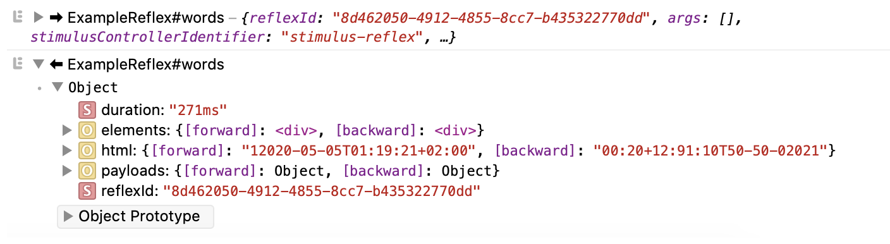

# Troubleshooting


## Logging

### Client-Side

You might want to know the order in which your Reflexes are called, how long it took to process each Reflex or what the Reflex response payload contains. Luckily you can enable Reflex logging to your browser's Console Inspector.



There are two ways to enable client debugging in your StimulusReflex instance.

You can provide `debug: true` to the initialize options like this:


```javascript
StimulusReflex.initialize(application, { consumer, debug: true })
```


You can also set debug mode after you've initialized StimulusReflex. This is especially useful if you just want to log the Reflex calls in your development environment:


```javascript
StimulusReflex.initialize(application, { consumer })
if (process.env.RAILS_ENV === 'development') StimulusReflex.debug = true
```


### Server-Side

By default, ActionCable emits particularly verbose Rails logger messages. You can **optionally** discard everything but exceptions by switching to the `warn` log level, as is common in development environments:


```ruby
# :debug, :info, :warn, :error, :fatal, :unknown
config.log_level = :warn
```


Alternatively, you can disable ActionCable logs at the framework level. This _may_ improve performance, at the cost of not having ActionCable logs when you need them.


```ruby
ActionCable.server.config.logger = Logger.new(nil)
```


## Flight Safety Card


If you're collaborating with a team during development, **make sure that they have caching turned on**. They just need to run `rails dev:cache` one time.



There's nothing about StimulusReflex 3+ that shouldn't work fine in a Rails 5.2 app if you're willing to do a bit of manual package dependency management.



Getting weird Console Inspector errors? Make sure that your `stimulus_reflex` **npm** package version is **identical** to your Ruby **gem** version.



For [reasons](https://github.com/rails/rails/issues/33412), it isn't possible for Rails to automatically hot reload Reflex classes in development mode. You _must_ restart your web server for changes to be picked up.



Do you have your `config/cable.yml` set up properly? You might need to [install Redis](http://tutorials.jumpstartlab.com/topics/performance/installing_redis.html).



If _something_ goes wrong, it's often because of the **spring** gem. 💣👎

You can test this by temporarily setting the `DISABLE_SPRING=1` environment variable and restarting your server.

To remove spring **forever**, here is the process we recommend:

1. `pkill -f spring`
2. Edit your Gemfile and comment out **spring** and **spring-watcher-listen**
3. `bin/spring binstub –-remove –-all`


